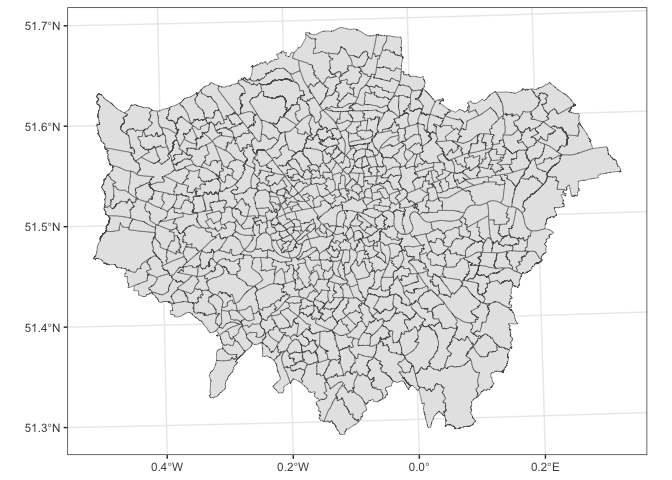
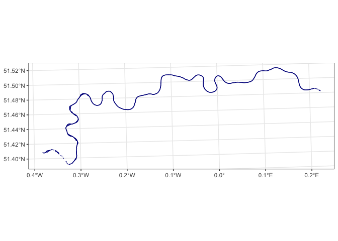
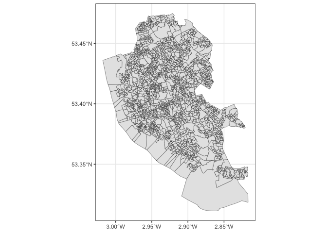
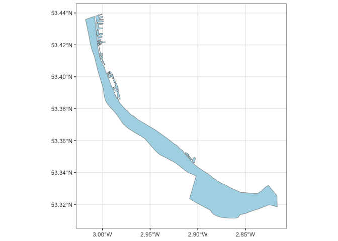
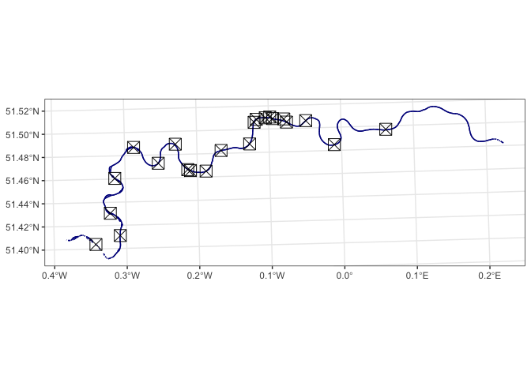

<!-- README.md is generated from README.Rmd. Please edit that file -->

# london_liverpool_data

This repository holds spatial dataframes related to a paper… Below is an
explanation of their sources.

## London

This dataframe contains polygons for the wards and boroughs of London.
It contains 625 unique rows.

The data is available from the [London
Datastore](https://data.london.gov.uk/) which was “created by the
Greater London Authority (GLA) as a first step towards freeing London’s
data”.

This particular file appears as a collection of shapefiles in zipped
form
[here](https://data.london.gov.uk/dataset/statistical-gis-boundary-files-london%20as%20a%20zipped%20set%20of%20shapefiles%20called:%20statistical-gis-boundaries-london.zip).

They have been uploaded here as one `.rds` file.

``` r

london <- readRDS("data/london.rds") |> 
  st_as_sf()

head(london)
#> Simple feature collection with 6 features and 7 fields
#> Geometry type: POLYGON
#> Dimension:     XY
#> Bounding box:  xmin: 516362.6 ymin: 159907.4 xmax: 522194.7 ymax: 172367
#> Projected CRS: OSGB36 / British National Grid
#>                     NAME  GSS_CODE HECTARES NONLD_AREA LB_GSS_CD
#> 1      Chessington South E05000405  755.173          0 E09000021
#> 2 Tolworth and Hook Rise E05000414  259.464          0 E09000021
#> 3             Berrylands E05000401  145.390          0 E09000021
#> 4              Alexandra E05000400  268.506          0 E09000021
#> 5               Beverley E05000402  187.821          0 E09000021
#> 6            Coombe Hill E05000406  442.170          0 E09000021
#>                BOROUGH POLY_ID                       geometry
#> 1 Kingston upon Thames   50840 POLYGON ((516401.6 160201.8...
#> 2 Kingston upon Thames  117160 POLYGON ((517829.6 165447.1...
#> 3 Kingston upon Thames   50449 POLYGON ((518107.5 167303.4...
#> 4 Kingston upon Thames   50456 POLYGON ((520480 166909.8, ...
#> 5 Kingston upon Thames  117161 POLYGON ((522071 168144.9, ...
#> 6 Kingston upon Thames  117159 POLYGON ((522007.6 169297.3...
```

``` r
ggplot(london) + geom_sf() + theme_bw()
```

<!-- -->

## River Thames

The dataframe for the river Thames in the Greater London area was
downloaded from OpenStreetMap via a query in the
[overpass-turbo](https://overpass-turbo.eu) wizard.

``` r

thames <- readRDS("data/thames.rds") |> 
  st_as_sf() |> 
  select(-(17:74))

head(thames)
#> Simple feature collection with 6 features and 23 fields
#> Geometry type: GEOMETRY
#> Dimension:     XY
#> Bounding box:  xmin: 517317.7 ymin: 167627.1 xmax: 517745 ymax: 169844.7
#> Projected CRS: OSGB36 / British National Grid
#>                     id             X.id CEMT admin_level boat boundary canoe
#> 1     relation/2263653 relation/2263653 <NA>        <NA> <NA>     <NA>  <NA>
#> 217      way/860421857    way/860421857 <NA>        <NA>  yes     <NA>  <NA>
#> 1.1   relation/2263653 relation/2263653 <NA>        <NA> <NA>     <NA>  <NA>
#> 125      way/194172489    way/194172489 <NA>        <NA>  yes     <NA>  <NA>
#> 217.1    way/860421857    way/860421857 <NA>        <NA>  yes     <NA>  <NA>
#> 1.2   relation/2263653 relation/2263653 <NA>        <NA> <NA>     <NA>  <NA>
#>       destination intermittent layer left.county left.district lock lock_name
#> 1       North Sea         <NA>  <NA>        <NA>          <NA> <NA>      <NA>
#> 217          <NA>           no  <NA>        <NA>          <NA> <NA>      <NA>
#> 1.1     North Sea         <NA>  <NA>        <NA>          <NA> <NA>      <NA>
#> 125          <NA>         <NA>  <NA>        <NA>          <NA> <NA>      <NA>
#> 217.1        <NA>           no  <NA>        <NA>          <NA> <NA>      <NA>
#> 1.2     North Sea         <NA>  <NA>        <NA>          <NA> <NA>      <NA>
#>       motorboat         name       NAME  GSS_CODE HECTARES NONLD_AREA LB_GSS_CD
#> 1          <NA> River Thames St. Mark's E05000412  137.578          0 E09000021
#> 217         yes River Thames St. Mark's E05000412  137.578          0 E09000021
#> 1.1        <NA> River Thames      Grove E05000408  192.034          0 E09000021
#> 125         yes River Thames      Grove E05000408  192.034          0 E09000021
#> 217.1       yes River Thames      Grove E05000408  192.034          0 E09000021
#> 1.2        <NA> River Thames    Canbury E05000403  124.241          0 E09000021
#>                    BOROUGH POLY_ID                       geometry
#> 1     Kingston upon Thames   50450 MULTILINESTRING ((517317.7 ...
#> 217   Kingston upon Thames   50450 MULTILINESTRING ((517317.7 ...
#> 1.1   Kingston upon Thames   50458 MULTILINESTRING ((517464.3 ...
#> 125   Kingston upon Thames   50458 LINESTRING (517493.5 167844...
#> 217.1 Kingston upon Thames   50458 MULTILINESTRING ((517464.3 ...
#> 1.2   Kingston upon Thames   51118 LINESTRING (517730.7 169634...
```

``` r
ggplot(thames) + 
  geom_sf(colour="darkblue") + 
  theme_bw()
```

<!-- -->

## Liverpool

The Liverpool dataset comes from the [Office of National
Statistics](https://www.nomisweb.co.uk/home/census2001.asp) as presented
by Francisco Rowe and Dani Arribas-Bel in their demonstration of
techniques for hierarchical spatial regression. It is available in
shapefile format at their [course
repository](https://gdsl-ul.github.io/san/) for Spatial Modeling for
Data Scientists, ENVS453, University of Liverpool.

``` r

liverpool <- readRDS("data/liverpool.rds") |> 
  st_as_sf()

head(liverpool)
#> Simple feature collection with 6 features and 20 fields
#> Geometry type: POLYGON
#> Dimension:     XY
#> Bounding box:  xmin: -2.976842 ymin: 53.39505 xmax: -2.960286 ymax: 53.39936
#> Geodetic CRS:  WGS 84
#>       oa_cd   lsoa_cd   msoa_cd    lad_cd      ward_nm  dstrt_nm    cnty_nm
#> 1 E00032987 E01006515 E02001383 E08000012    Riverside Liverpool Merseyside
#> 2 E00032988 E01006514 E02001383 E08000012 Princes Park Liverpool Merseyside
#> 3 E00032989 E01033768 E02001383 E08000012 Princes Park Liverpool Merseyside
#> 4 E00032990 E01033768 E02001383 E08000012 Princes Park Liverpool Merseyside
#> 5 E00032991 E01033768 E02001383 E08000012 Princes Park Liverpool Merseyside
#> 6 E00032992 E01033768 E02001383 E08000012 Princes Park Liverpool Merseyside
#>   cntry_nm pop     age_60 unemployment      lat      long    males   lt_ill
#> 1  England 198 0.11616162    0.1130435 53.39821 -2.976786 46.46465 19.19192
#> 2  England 348 0.16954023    0.1458333 53.39813 -2.969072 58.33333 33.62069
#> 3  England 333 0.09009009    0.1049724 53.39778 -2.965290 64.26426 23.72372
#> 4  England 330 0.15151515    0.1329787 53.39802 -2.963597 59.69697 23.03030
#> 5  England 320 0.04687500    0.1813725 53.39706 -2.968030 60.62500 25.00000
#> 6  England 240 0.05833333    0.2519685 53.39679 -2.966494 57.91667 28.33333
#>     Bhealth VBhealth  no_qual   manprof  lt_illness
#> 1  6.565657 1.515152 24.69136  7.643312 -0.40846333
#> 2 10.344828 1.436782 14.84848 13.375796  1.07352202
#> 3  6.606607 2.102102 15.38462 10.204082  0.05700030
#> 4  5.151515 2.424242 17.91531 15.224913 -0.01422124
#> 5  8.750000 2.187500 12.58278 11.333333  0.18808720
#> 6  6.666667 2.916667 27.47748  5.479452  0.53045533
#>                         geometry
#> 1 POLYGON ((-2.97485 53.39747...
#> 2 POLYGON ((-2.965136 53.3982...
#> 3 POLYGON ((-2.963022 53.3987...
#> 4 POLYGON ((-2.962144 53.3968...
#> 5 POLYGON ((-2.965556 53.3974...
#> 6 POLYGON ((-2.965556 53.3974...
```

``` r
ggplot(liverpool) + 
  geom_sf() + 
  theme_bw()
```

<!-- -->

Some slight modifications were made to the original file such as making
the administrative codes into factors, scaling the limiting long-term
illness (LLTI) variable, and giving unemployment an unabbreviated name.

``` r
 liverpool <- downloaded_file |>
  st_make_valid() |>
  st_transform(4326) |>
  mutate(
    oa_cd = factor(oa_cd),
    lsoa_cd = factor(lsoa_cd),
    msoa_cd = factor(msoa_cd),
    lt_illness = as.vector(scale(lt_ill))) |>
  rename(unemployment = unemp)
```

## River Mersey

The river Mersey dataset in the Liverpool region comes from the UK
Government Environment Agency’s [data services
platform](https://environment.data.gov.uk/catchment-planning/WaterBody/GB531206908100)

``` r

mersey <- readRDS("data/mersey.rds") |> 
  st_as_sf()

head(mersey)
#> Simple feature collection with 1 feature and 0 fields
#> Geometry type: MULTIPOLYGON
#> Dimension:     XY
#> Bounding box:  xmin: -3.017836 ymin: 53.31128 xmax: -2.816709 ymax: 53.4394
#> Geodetic CRS:  WGS 84
#>                         geometry
#> 1 MULTIPOLYGON (((-3.002352 5...
```

``` r
ggplot(mersey) + 
  geom_sf(fill="lightblue") + 
  theme_bw()
```

<!-- -->

## Thames River Crossings

Information about the various crossing of the river Thames were scraped
from
[Wikipedia](https://en.wikipedia.org/wiki/List_of_crossings_of_the_River_Thames)
using the following code. The dataset `crossing_roadped` contains
crossings by road or which are available to pedestrians. This excludes
things such as railway crossings, service or utility tunnels, gondola
lifts, and flood barriers.

``` r
### Scrape river-crossings data
library(rvest, quietly = TRUE)
#> 
#> Attaching package: 'rvest'
#> The following object is masked from 'package:readr':
#> 
#>     guess_encoding
library(httr, quietly = TRUE)
library(polite, quietly = TRUE)
library(janitor, quietly = TRUE)
#> 
#> Attaching package: 'janitor'
#> The following objects are masked from 'package:stats':
#> 
#>     chisq.test, fisher.test

url <- "https://en.wikipedia.org/wiki/List_of_crossings_of_the_River_Thames"

url_bow <- polite::bow(url)

ind_html <-
  polite::scrape(url_bow) %>%  # scrape web page
  rvest::html_nodes("table.wikitable") %>% # pull out specific table
  rvest::html_table(fill = TRUE) 

# having scraped data, a bit of a messy procedure below to tidy it up into sf dataframe...

names(ind_html) <- c(
  "North Sea to London",
  "East London",
  "Central London",
  "South West London",
  "London to Windsor",
  "Windsor to Reading",
  "Reading to Oxford",
  "Oxford to Cricklade",
  "Cricklade to the source"
)

# only want the crossings within greater london (east, central and west)
east <- 
  ind_html[[2]] |>  
  clean_names() |> 
  select(1:3)
names(east) <- c("crossing","type","coords")

central <- 
  ind_html[[3]] |>  
  clean_names() |> 
  select(1:3)
names(central) <- c("crossing","type","coords")

west <- 
  ind_html[[4]] |>  
  clean_names() |> 
  select(1:3)
names(west) <- c("crossing","type","coords")

crossings <- rbind(east,central,west) |> 
  data.frame() 

# dont want crossings such as "Utility tunnel[10]","Flood barrier","Gondola lift, transport route","Utility tunnel", "Ferry route"
# filter by road or pedestrian crossings
roadped <- which(str_detect(crossings$type,"Pedestrian | pedestrian | road | Road | Bridge | footbridge"))

crossings_roadped <- crossings[roadped,]

# more messing around to change from awkward wikipedia degree/minute/second structure...

# Extract content up to and including the letter "W" or "E"
crossings_roadped$coords <- sub("(.*W|E.*)\\b.*", "\\1", crossings_roadped$coords)

# Function to extract degrees, minutes, and seconds
extract_coords <- function(coord) {
  # Split the coordinates by space
  parts <- unlist(strsplit(coord, " "))
  
  # Extract degrees, minutes, and seconds for latitude
  lat_degrees <- as.numeric(gsub("[^0-9.-]", "", substr(parts[1], 1, regexpr("°", parts[1])-1)))
  lat_minutes <- as.numeric(gsub("[^0-9.-]", "", substr(parts[1], regexpr("°", parts[1])+1, regexpr("′", parts[1])-1)))
  lat_seconds <- as.numeric(gsub("[^0-9.-]", "", substr(parts[1], regexpr("′", parts[1])+1, regexpr("″", parts[1])-1)))
  
  # Extract degrees, minutes, and seconds for longitude
  lon_degrees <- as.numeric(gsub("[^0-9.-]", "", substr(parts[2], 1, regexpr("°", parts[2])-1)))
  lon_minutes <- as.numeric(gsub("[^0-9.-]", "", substr(parts[2], regexpr("°", parts[2])+1, regexpr("′", parts[2])-1)))
  lon_seconds <- as.numeric(gsub("[^0-9.-]", "", substr(parts[2], regexpr("′", parts[2])+1, regexpr("″", parts[2])-1)))
  
  return(c(lat_degrees, lat_minutes, lat_seconds, lon_degrees, lon_minutes, lon_seconds))
}

# Apply function to coords column
coords_split <- t(sapply(crossings_roadped$coords, extract_coords))

# Convert to data frame
coords_df <- as.data.frame(coords_split)

# Rename columns
names(coords_df) <- c("lat_degrees", "lat_minutes", "lat_seconds", "lon_degrees", "lon_minutes", "lon_seconds")

coords_df$latitude <- coords_df$lat_degrees + (coords_df$lat_minutes/60) + (coords_df$lat_seconds/3600)
coords_df$longitude <- coords_df$lon_degrees + (coords_df$lon_minutes/60) + (coords_df$lon_seconds/3600)

crossings_roadped$latitude <- coords_df$latitude
crossings_roadped$longitude <- coords_df$longitude

# multiply those west of Greenwich meridian by -1
crossings_roadped$longitude[which(!str_detect(crossings_roadped$coords, "E$"))] <- crossings_roadped$longitude[which(!str_detect(crossings_roadped$coords, "E$"))] * -1

# nudge Greenwich tunnel location to put it exactly on river
crossings_roadped$latitude[crossings_roadped$crossing == "Greenwich foot tunnel"] <- 51.485
crossings_roadped$longitude[crossings_roadped$crossing == "Greenwich foot tunnel"] <- -0.01

# nudge Woolwich tunnel location to put it exactly on river
crossings_roadped$latitude[crossings_roadped$crossing == "Woolwich foot tunnel"] <- 51.497

# finally, sf dataframe with same crs as thames and london...
crossings_roadped <- crossings_roadped |> st_as_sf(coords = c("longitude","latitude"), crs=4326)
```

``` r
ggplot() + 
  geom_sf(data=thames, colour="darkblue") + 
  geom_sf(data=crossings_roadped, shape=7, size=5) + 
  theme_bw()
```

<!-- -->
